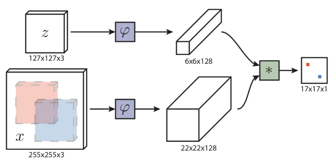
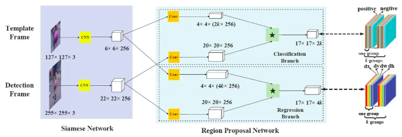
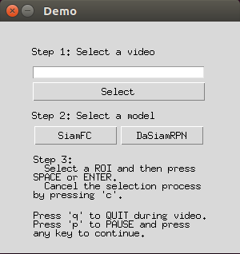
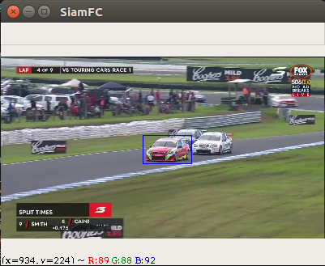
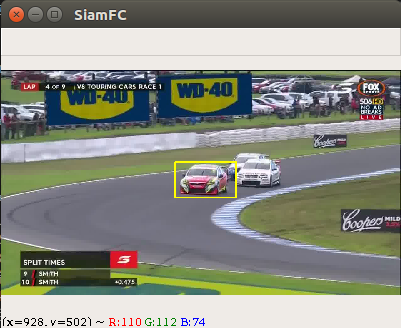
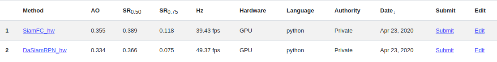
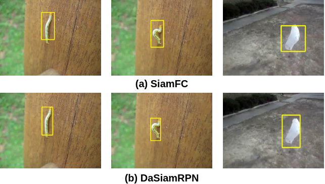

# SiamFC & DaSiamRPN

> Ubuntu16.04 + Python3.6.9 + Numpy1.16.4 + OpenCV4.2.0 + PyTorch0.4.1(GPU)/1.10(CPU)

## Intro
* A repo for object tracking
* Based on SiamFC & DaSiamRPN
* Use the GOT-10k toolkit
* Demo & Visualization

## Algorithm
Two typical algorithms based on Siamese.

### a. SiamFC



### b. DaSiamRPN
DaSiamRPN is based on SiamRPN



## Files Structure
* [SiamFC](./SiamFC) --- Code for SiamFC.
  * [SiamFC.py](./SiamFC/SiamFC.py)(model)
  * [tracker.py](./SiamFC/tracker.py)(Class TrackerSiamFC based on GOT-10K toolkit)
  * [pairwise.py](./SiamFC/pairwise.py)
  * [train.py](./SiamFC/train.py)
* [DaSiamRPN](./DaSiamRPN) --- Code for DaSiamRPN(actually SiamRPN structure)
  * [DasiamRPN.py](./DaSiamRPN/DaSiamRPN.py)(model)
  * [tracker.py](./DaSiamRPN/tracker.py)(Class TrackerDaSiamRPN based on GOT-10K toolkit)
  * [run_SiamRPN](./DaSiamRPN/run_SiamRPN.py)(auxiliary code fo traker)
  * [utils](./DaSiamRPN/utils.py)
* [data](./data) --- Folder for storing data([GOT-10K toolkit](https://github.com/got-10k/toolkit))
* [demo_video](./demo_video) --- Video for demo
* [test_results](./test_results) --- My test results on GOT-10K(zip)
* [test.py](./test.py)
* [demo.py](./demo.py)
* [img2video.py](./img2video.py) --- Tool to convert images in GOT-10K test set to video. (For demo)

## GOT-10K Dataset
* A large, high-diversity, one-shot database for generic object tracking in the wild
* Contains more than 10,000 video segments of real-world moving objects and over 1.5 million manually labeled bounding boxes
* Covers a majority of 560+ classes of real-world moving objects and 80+ classes of motion patterns
* For More Info [GOT-10K Dataset](http://got-10k.aitestunion.com/index)

## How to Start
### a. Training
Only SiamFC can be trained for now. Training code for DaSiamRPN is on the way :)
```
cd SiamFC
```

```
python train.py
```
> You can get **pretrained model** from Google Drive [SiamFC](https://drive.google.com/open?id=1Qu5K8bQhRAiexKdnwzs39lOko3uWxEKm) / [DasiamFPN](https://drive.google.com/file/d/1-vNVZxfbIplXHrqMHiJJYWXYWsOIvGsf/view?usp=sharing)

### b. Testing
Run [test.py](./test.py) to test. "-Model_id" represents different models, where 0(default) --- SiamFC, 1 --- DaSiamRPN

```
python test.py -model_id=0/1
```

### c. Demo
Run [demo.py](./demo.py) for demo & visualization on video.

```
python demo.py
```
The UI is shown as below.



JUST Follow the STEPS:

  * Step 1: Select a video
  * Step 2: Select a method (SiamFC or DaSiamRPN)
  * Step 3: Select a ROI in the first frame. The bounding box of the selected ROI is blue. Press SPACE or ENTER to strat tracking. Press "c" to cancel and select a new ROI.
  * Step 4: While tracking, [1]press "q" to quit; [2] press "p" to pause and press any key to continue; [3] Press 's' to SAVE the image. The bounding box of tracking result is yellow.
  



## Some Results

NOTICE: All the results shown below is test on pretrained model.

### GOT-10K Results

The tracking results are submitted to GOT-10k and automatically evaluated by the sever. Performance of the pretrained model is shown below. 



### Visualization Results

Two methods are tested on the same video for comparation. The experiments are based on [demo.py](./demo.py). In order to compare the performance, there is a large deformation of the object to be tracked in the selected video. The visualization results are shown below. 



## Reference
[1] Huang L , Zhao X , Huang K . GOT-10k: A Large High-Diversity Benchmark for Generic Object Tracking in the Wild[J]. 2018.

[2] Bertinetto L , Valmadre J , Henriques J F , et al. Fully-convolutional siamese networks for object tracking[J]. 2016.

[3] Li B , Yan J , Wu W , et al. High Performance Visual Tracking with Siamese Region Proposal Network[C]// 2018 IEEE/CVF Conference on Computer Vision and Pattern Recognition (CVPR). IEEE, 2018.

[4] Zhu Z, Wang Q, Li B, et al. Distractor-aware siamese networks for visual object tracking[C]//Proceedings of the European Conference on Computer Vision (ECCV). 2018: 101-117. 

[5] https://github.com/got-10k/siamfc

[6] https://github.com/foolwood/DaSiamRPN